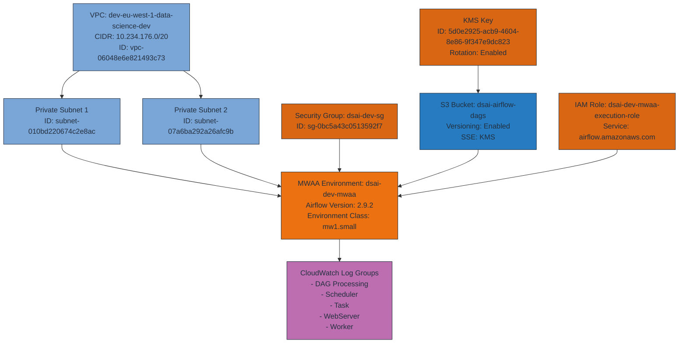

# MWAA Architecture Diagram

## MWAA Architecture Summary

The architecture shows a fully managed Apache Airflow environment in AWS with the following components:

• **MWAA Environment**: Running Airflow 2.9.2 on mw1.small class with 2 workers, 2 schedulers, and 2 webservers
• **Networking**: Deployed in a private VPC (dev-eu-west-1-data-science-dev) with two private subnets
• **Security**: Protected by a security group that allows self-referencing traffic and HTTPS from the 10.0.0.0/8 CIDR range
• **Storage**: Uses an S3 bucket (dsai-airflow-dags) for DAGs and requirements with versioning enabled
• **Encryption**: KMS key for S3 bucket encryption with key rotation enabled
• **IAM**: Custom execution role with permissions for S3, CloudWatch, SQS, KMS, Secrets Manager, ECS, and ECR
• **Monitoring**: CloudWatch log groups for DAG processing, scheduler, task, webserver, and worker logs

The environment is configured for private access only, meaning the Airflow UI is only accessible from within the VPC or through VPC endpoints.

You can view the complete diagram and details in the created file. Would you like me to explain any specific aspect of the architecture in more detail?

## Architecture Details

### VPC and Networking
- **VPC**: dev-eu-west-1-data-science-dev (vpc-06048e6e821493c73)
- **CIDR Block**: 10.234.176.0/20
- **Private Subnets**: 
  - subnet-010bd220674c2e8ac
  - subnet-07a6ba292a26afc9b
- **Security Group**: dsai-dev-sg (sg-0bc5a43c0513592f7)
  - Allows self-referencing traffic
  - Allows inbound HTTPS (443) from 10.0.0.0/8
  - Allows all outbound traffic

### Storage
- **S3 Bucket**: dsai-airflow-dags
  - Versioning: Enabled
  - Server-Side Encryption: KMS
  - Contains DAGs, requirements.txt

### Security
- **KMS Key**: 5d0e2925-acb9-4604-8e86-9f347e9dc823
  - Used for S3 bucket encryption
  - Key rotation enabled
- **IAM Role**: dsai-dev-mwaa-execution-role
  - Service principals: airflow-env.amazonaws.com, airflow.amazonaws.com, ecs-tasks.amazonaws.com
  - Permissions for S3, CloudWatch Logs, SQS, KMS, Secrets Manager, ECS, ECR

### MWAA Environment
- **Name**: dsai-dev-mwaa
- **Airflow Version**: 2.9.2
- **Environment Class**: mw1.small
- **Workers**: Min 2, Max 2
- **Schedulers**: 2
- **Webservers**: Min 2, Max 2
- **Access Mode**: PRIVATE_ONLY

### Monitoring
- **CloudWatch Log Groups**:
  - airflow-dsai-dev-mwaa-DAGProcessing
  - airflow-dsai-dev-mwaa-Scheduler
  - airflow-dsai-dev-mwaa-Task
  - airflow-dsai-dev-mwaa-WebServer
  - airflow-dsai-dev-mwaa-Worker
